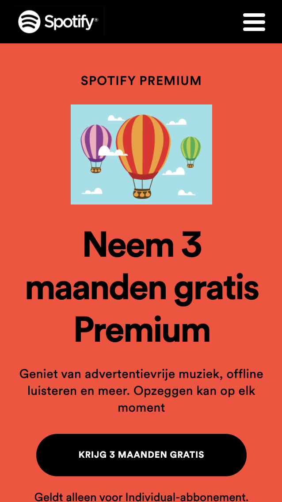
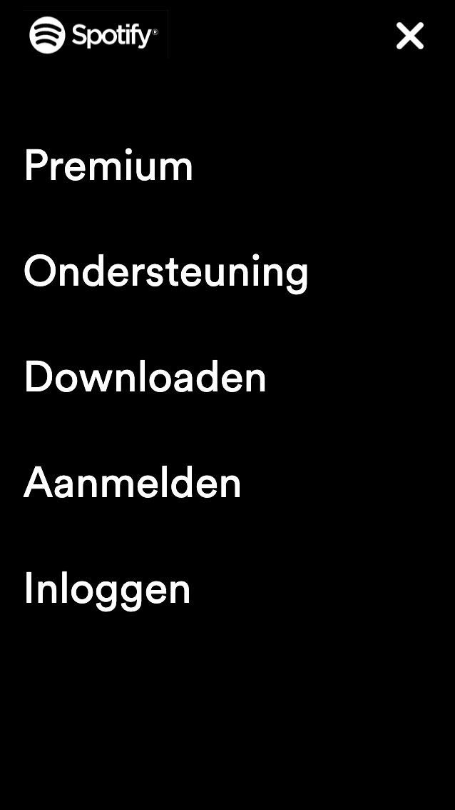
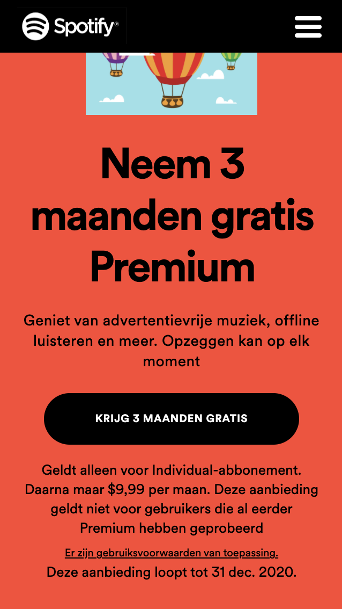
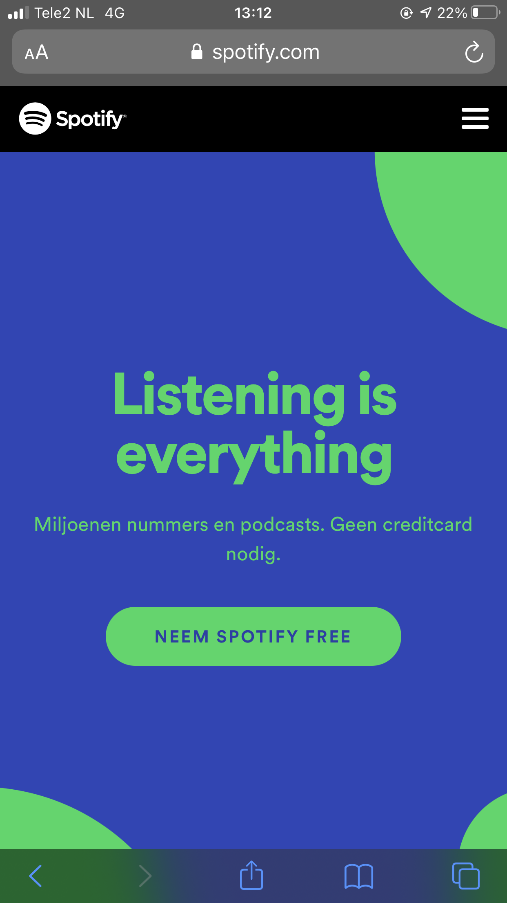
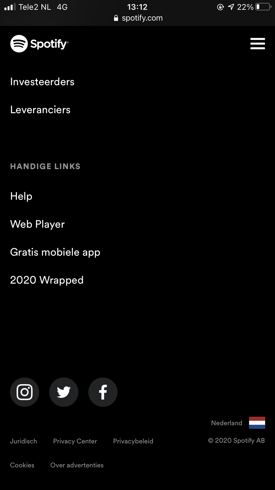
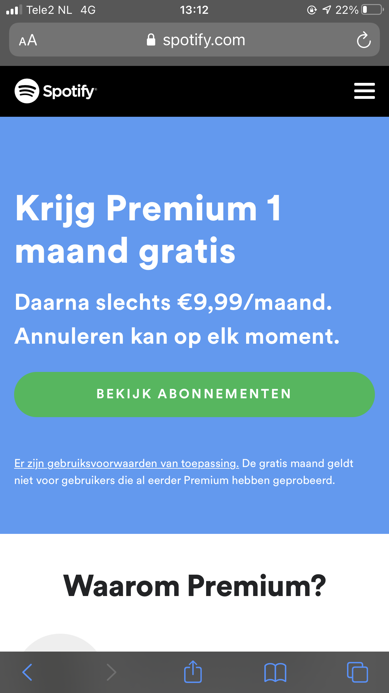
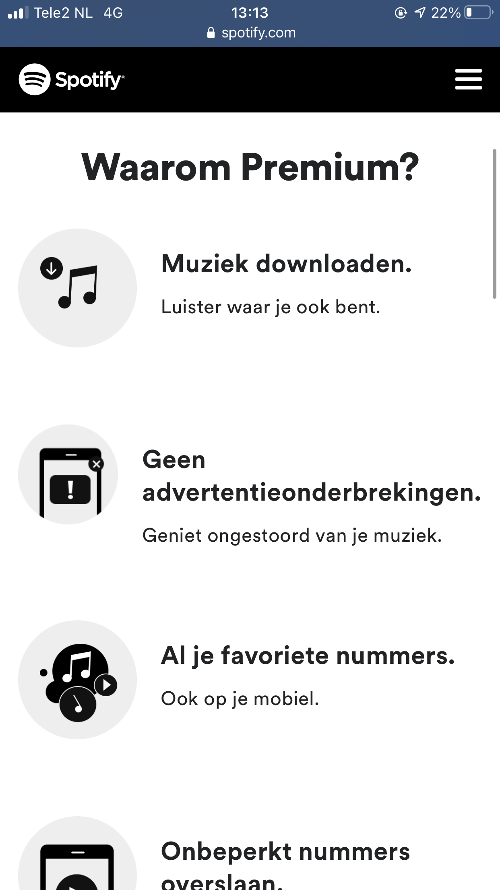
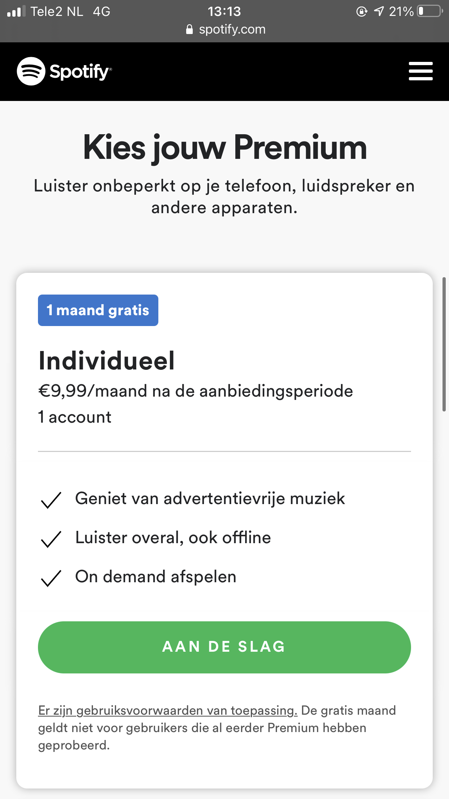

# Procesverslag
**Auteur:** Tim Hart

Markdown cheat sheet: [Hulp bij het schrijven van Markdown](https://github.com/adam-p/markdown-here/wiki/Markdown-Cheatsheet). Nb. de standaardstructuur en de spartaanse opmaak zijn helemaal prima. Het gaat om de inhoud van je procesverslag. Besteedt de tijd voor pracht en praal aan je website.

## Bronnenlijst
1. -mijn grootste bron was w3schools: https://www.w3schools.com/-
2. -Verder heb ik inspiratie gehaald uit de opdrachten van FED: https://dlo.mijnhva.nl/d2l/le/content/192710/Home-
3. -Voor het hamburger menu heb ik inspiratie gezocht op youtube door de volgende twee filmpjes te bekijken:
https://www.youtube.com/watch?v=F-mvXKKoSCU
En 
https://www.youtube.com/watch?v=dIyVTjJAkLw
4. Als laatste heb ik hulp gezocht bij medestudenten en student assistenten in het kanaal van FED op teams.-

## Eindgesprek (week 7/8)

-Ik vond dat het structureren en nette HTML / CSS code schrijven heel goed ging, beter dan dat ik eerst deed. Ik had als focus voor responsive gekozen, alleen ik weet niet waarom, maar elke keer als ik een media query schreef voor een bepaald element ging het andere element stuk voor Mobile, ik heb dit uiteindelijk opgegeven.. en ben verder gegaan met zoveel mogelijk voor de scope plane..-

**Screenshot(s):**

-screenshot(s) van je eindresultaat-

## Voortgang 3 (week 6)

-same as voortgang 1-

## Voortgang 2 (week 5)

-Het hamburger menu met animatie van hamburger menu naar kruis heb ik gedaan dmv js en transform-

## Voortgang 1 (week 3)

### Stand van zaken

-dit ging goed & dit was lastig-

**Screenshot(s):**

-dmv position: fixed; heb ik ervoor gezorgd dat de nav balk op zijn plek blijft wanneer ik naar beneden scroll-
-dmv z-index: 1; zorg ik ervoor dat de nav balk boven elk element blijft.-

### Agenda voor meeting

### Verslag van meeting

-na afloop snel uitkomsten vastleggen-

## Breakdownschets (week 1)

-Allereerst ben ik begonnen met de structuur van de html. Door te kijken welke HTML elementen je nodig hebt krijg je een beter beeld van de structuur.-

## Intake (week 1)
-uitwerken voor de kick-off werkgroep - begin van de eerste week-

**Je startniveau:** Rode piste! Ik probeer thuis zoveel mogelijk te coderen. Het lukt alleen niet altijd zoals ik wil..

**Je focus:** Ik kies hier responsive.

**Je opdracht:** Ik wil spotify namaken. https://www.spotify.com/nl/

**Screenshot(s) van de eerste pagina (small screen):**

**Screenshot(s) van de tweede pagina (small screen):**

